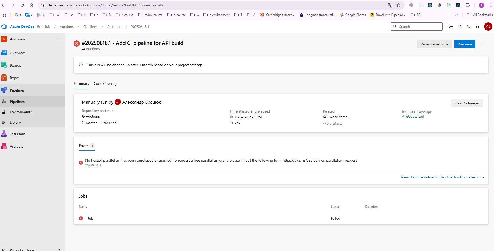

## 01 Initial

### Azure DevOps

direct link: https://aex.dev.azure.com/me

### git

git init

git add .
git commit -m "Initial commit: clean structure with API"
git remote add origin https://Bratsiuk@dev.azure.com/Bratsiuk/Auctions/_git/Auctions
git push -u origin master --force

git remote add github https://github.com/abratsiuk/Auctions
git push -u github master

--================
origin → Azure DevOps
github → GitHub

--================
git push origin master
git push github master

git push origin master; git push github master;

## back

### front: Vite + React + Typescript

front:
npm create vite@latest .

npm install
npm run dev

npm install @reduxjs/toolkit react-redux

### tasks

https://dev.azure.com/Bratsiuk/Auctions

git commit -m "kjkgkhg hghjg gghjg. Fixes #4"
4 - id in Azure DevOps

### error in CI

Iskin:
Александр Петрович, это стандартная **засада для новых аккаунтов в Azure DevOps**.

### ❗ Проблема:

> **"No hosted parallelism has been purchased or granted"**
> ➜ Это означает, что **Вашему аккаунту не разрешено запускать пайплайны на бесплатных агентских машинах (hosted agents)**.

---

### 🛠 Что делать:

Чтобы **бесплатно получить доступ к пайплайнам**, нужно:

1. Перейти по ссылке:
   👉 [https://aka.ms/azpipelines-parallelism-request](https://aka.ms/azpipelines-parallelism-request)

2. Заполнить короткую форму:

   * Укажите, что Вы **используете Azure DevOps для личного/учебного проекта**
   * Организация: `Bratsiuk`
   * Объясните, что хотите научиться DevOps (например, "Learning CI/CD for personal .NET & React project")

3. Подождать от нескольких часов до 1 рабочего дня — Вам **дадут 1 параллельный агент бесплатно**.

Если будет отказ — можно временно настроить self-hosted agent. Но пока лучше просто дождаться.
------------

I send request 18.06.2025