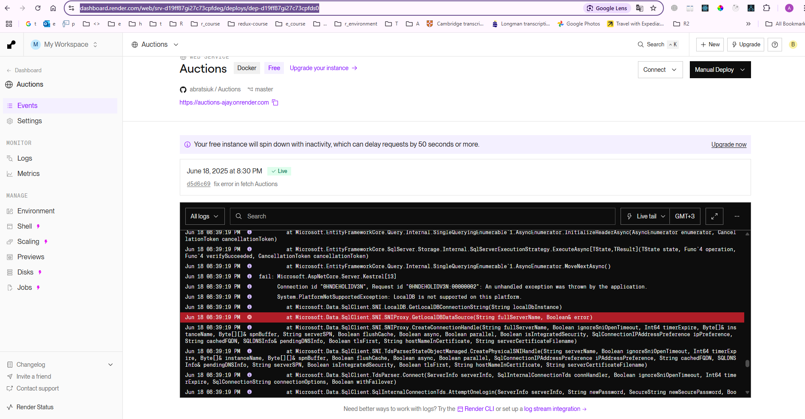

**CD для backend'а (API)**.

---

## 🧩 Что такое CD для backend

**Автоматически собирать и выкладывать API** при пуше в `master`. То есть:

* Вы закоммитили код
* Azure DevOps сам:

  1. Собрал API
  2. Опубликовал его
* Готовый API стал доступен по URL

---

## 🧭 Варианты для размещения API

| Вариант                  | Преимущества              | Минусы                 |
| ------------------------ | ------------------------- | ---------------------- |
| ✅ **Render.com**         | Просто, бесплатно, .NET 8 | Медленный cold start   |
| ✅ **Railway.app**        | Просто, бесплатно, Docker | Ограничения в CPU      |
| 🔷 **Azure App Service** | Родное, стабильно         | Нужно настроить руками |
| 🔷 **Fly.io**            | Быстро, гибко             | Чуть сложнее           |

---

## 🟢 Лучший вариант для Вас сейчас:

### ✅ **Render.com (без Docker)**

* Не требует контейнеров
* Есть пресет для `.NET Core`
* Автодеплой по GitHub Push
* URL вида: `https://your-api.onrender.com/api/auctions`

---

## 🔨 Что нужно сделать:

1. Зарегистрироваться на [https://render.com](https://render.com)
2. Нажать **“New +” → Web Service**
3. Подключить свой GitHub-репозиторий
4. Указать:

   * Root Directory: `api/`
   * Build Command: `dotnet build`
   * Start Command: `dotnet api.dll`
   * .NET 8 (он определится сам)
5. Нажать "Create Web Service"

---


======ERROR IN DOCRER IN Render - for fix - use SqlLite ==============================



> ❌ `LocalDB is not supported on this platform.`
> 💥 `SqlLocalDB.GetLocalDbInstance` → это Windows-only, и оно не работает в Linux-контейнерах Render.

---

## 📌 Что произошло

Render использует **Linux-контейнеры**, а `LocalDB` — это **чисто Windows-решение**, работающее только локально.

---

## ✅ Решение

Чтобы Ваш API заработал на Render, нужно:

### 1. Использовать **полноценный SQL Server**, например:

* Azure SQL (простое облачное решение от Microsoft)
* Railway PostgreSQL (бесплатный вариант)
* Render PostgreSQL
* Supabase или Planetscale (если уйдёте в MySQL/PostgreSQL)

### 2. Или переключиться на встроенную `SQLite`, чтобы не париться с БД на этапе обучения

---

## 🔄 Простой вариант для CD / демо: SQLite

### Шаги:

1. Замените строку подключения в `appsettings.json`:

```json
"ConnectionStrings": {
  "DefaultConnection": "Data Source=auctions.db"
}
```

2. В `Program.cs` замените:

```csharp
builder.Services.AddDbContext<AppDbContext>(options =>
    options.UseSqlite(builder.Configuration.GetConnectionString("DefaultConnection")));
```

3. Добавьте NuGet-пакет (локально):

```bash
dotnet add package Microsoft.EntityFrameworkCore.Sqlite
```

4. Пересоберите, отправьте на GitHub — Render всё пересоберёт и поднимет с SQLite

---

✅ SQLite хранит данные в `auctions.db`, лежащем в `/app/` — и он полностью совместим с EF Core. Отличный выбор для демонстрации и dev-сборки.


